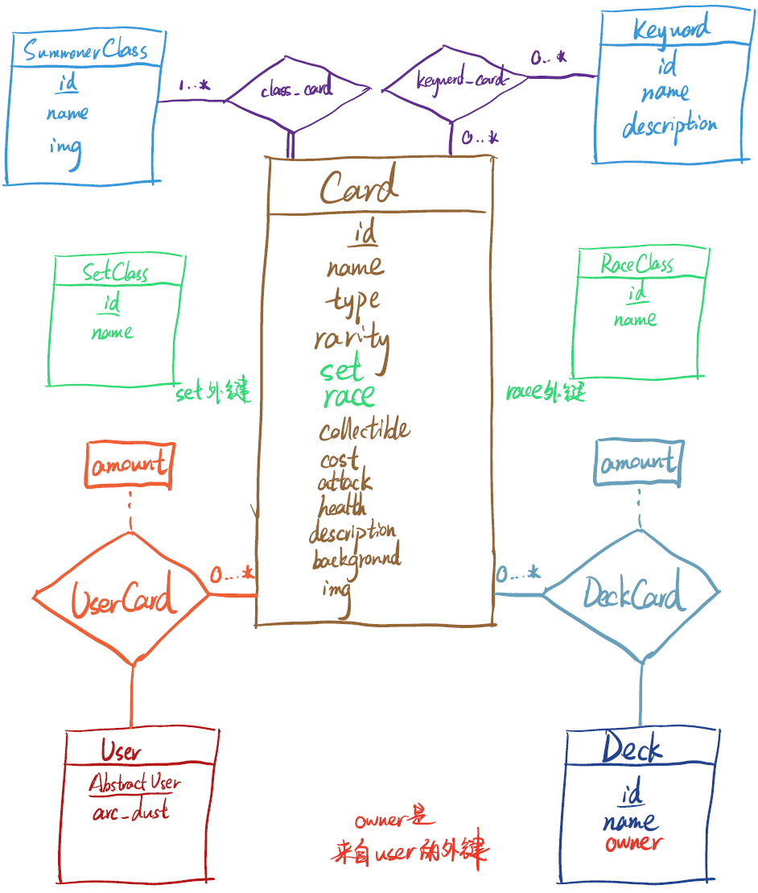
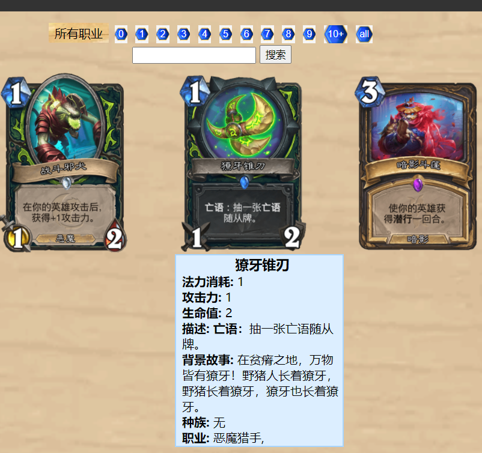
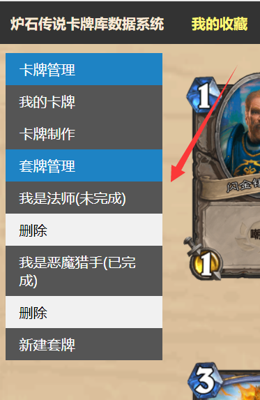
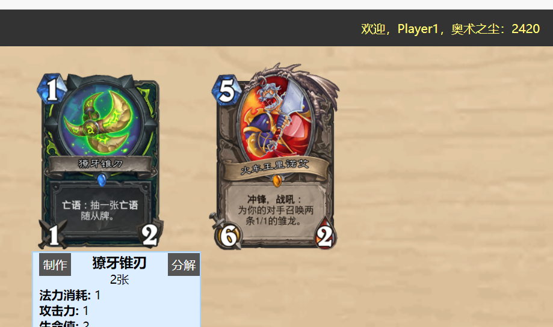
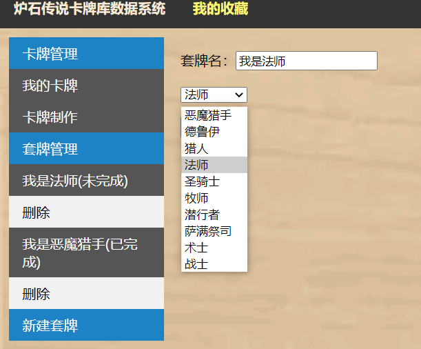
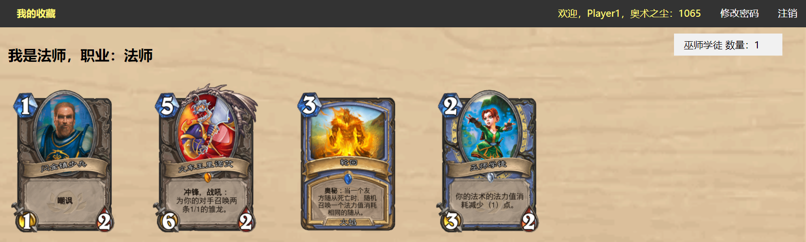
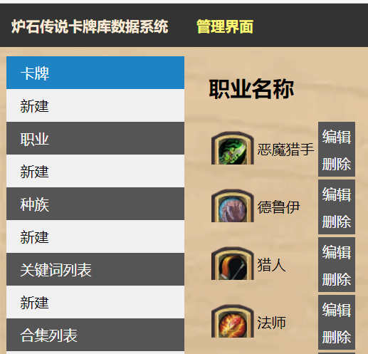
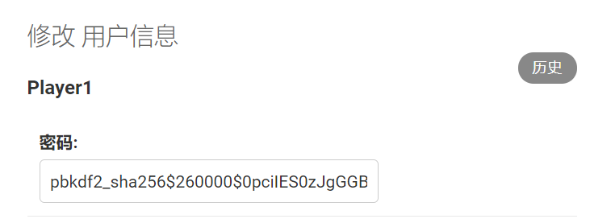
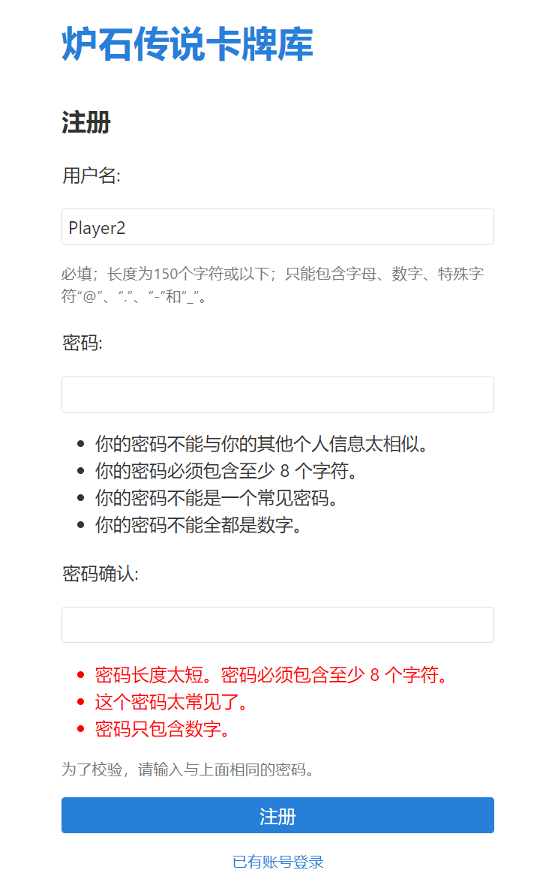

# 实验报告

> 张驰一 19307130043 张开元 19307130227


# 一、实验题目

### 实验题目：

炉石传说卡牌库系统

### 实验背景：

一套**卡牌库**系统对卡牌的制造、删除、更新、搜索等方面进行统一管理，同时需要对每个玩家的**个人收藏**中卡牌的合成、分解进行管理，同时需要对每个玩家的所有**套牌**进行管理，可以向套牌中添加自己收藏中的卡牌。

除了在游戏（炉石传说）内，用户应当能在该网站上浏览到所有的卡牌及其详细信息，并且模拟游戏内对**个人收藏**的管理。


我们二人都是炉石传说的忠实玩家，选定这个题目的初衷是想模拟实现这个系统。未来如果有可能的话，完成网站布局，能够得到官方数据的授权，为不方便登录游戏的时候提供一个更轻量化的卡牌管理视图。


# 二、开发环境

> (操作系统，数据库管理软件，编程语言，客户端或web开发环境)

在`windows10`上进行开发，

使用`django`自带的`admin`进行数据库管理(version==3.2.3)

数据库选用`SQLite`

编程语言为python(version==3.9)

web开发环境

# 三、数据库设计

整个数据库共11个表，围绕Card表展开。

首先是**实体集**：

### SummonerClass职业

> 鉴于暴雪（炉石传说所属公司）有过加入新职业的操作（外域版本的恶魔猎手），并且有谣言称今年年要加入武僧，所以把职业单独做成一个可增改的类

id int：主键，自增

name char：名称，Unique约束

img file：图标


### RaceClass种族

id int：主键，自增

name char：名称，Unique约束


### SetClass合集

id int：主键，自增

name char：名称，Unique约束


### Keyword关键词

id int：主键，自增

name char：名称，Unique约束

description char：描述


### Card卡牌

id int: 主键，自增

name char：名称

type enum：卡牌类型，分为'随从'，'武器'，'法术'三类

rarity enum：稀有度，分为'基本'、'普通'、'稀有'、'史诗'、'传说'五类

collectible boolean：是否可合成

cost int：费用

attack int：攻击力

health int：生命值

description char：卡牌描述

background char：卡牌背景

img file：卡牌图片


set(set_id)：外键约束to Set，卡牌所属合集，实质上存储set的id，为int型

race(race_id)：外键约束to Race，卡牌的种族，允许为空


### User用户

> 继承自`django.contrib.auth.models.AbstractUser`，以下只说用到的类型

id int：主键

username char：名称，Unique约束，必填，长度为150个字符或以下

password char：密码，用`pbkdf2_sha256`加密后的密文存储在数据库中。

is_stuff boolean：是否为工作人员


arc_dust BigInt：奥术之尘数量（卡牌合成与分解所用到的货币），默认初始化为0


### Deck套牌

id int：主键，自增

name char：名称

owner(user_id)：外键约束to User，串联删除与更新


然后是**关系集**：

### class_card卡牌所属职业

> 这是一个多对一关系，因为多职业卡的存在，一张卡可能会对应多个职业。但是每张卡牌都必须有至少有一个职业

id int：主键

SummonerClass_id int：职业

Card_id int：卡牌

### class_card卡牌所属职业

> 这是一个多对多关系，因为多职业卡的存在，一张卡可能会对应多个职业。但是每张卡牌都必须有至少有一个职业

id int：主键

SummonerClass_id int：职业

Card_id int：卡牌

### keyword_card卡牌中包含的关键词

> 这是一个多对多关系，因为多职业卡的存在，一张卡可能会对应多个职业。但是每张卡牌都必须有至少有一个职业

id int：主键

Keywords_id int：职业

Card_id int：卡牌




# 四、系统设计

### 浏览，搜索所有卡牌

在主页界面登录后，点击“浏览卡牌”超链接，便可查询所有卡牌。

画面正中列出了数据库中的所有卡牌配图，将鼠标放在图片上，会弹出该卡牌的详细信息。

在整个网页的颈部，是我们提供的卡牌筛选与搜索功能：

* 根据卡牌属性“职业(SummonerClass)”精确筛选
  将鼠标放置在“所有职业”处，出现所有职业的下拉列表，点击一个职业来精确匹配该职业的卡牌。

* 跟据卡牌属性“费用(Cost)”精确筛选

  点击上方的法力水晶，精确筛选该法力水晶的卡牌

* 关键词搜索
  依次匹配卡牌描述、卡牌稀有度、卡牌关键词、卡牌名，模糊搜索，结果取并集。

* 上几个搜索与筛选可以同时使用，最终返回的卡牌结果为交集

前端界面维护一个html form，借由javascrfript脚本获取搜索匹配所用的三个参数：职业、费用、搜索词，借由POST request提交给后端（详见`templates/cards.html`)
我们调用查询语句获得卡牌全体列表, 然后在其中限定各个属性复选，具体实现参照`Hs/views.py`

```python
# Hs/views.py 
def search_cards(request):
    cd_list = select.card_all()
    search_word = request.POST.get('search_word')
    sc_sel = request.POST.get('sc')
    cost_sel = request.POST.get('cst')

    if cost_sel != '-1':
        cd_list = select.card_strict(_card_list=cd_list, s_cost=cost_sel)
    if sc_sel != '所有职业':
        cd_list = select.card_strict(_card_list=cd_list, s_class_name=sc_sel)

    cd_list = select.card_vague_search(search_word, cd_list)
    # ...
```

### 我的收藏与套牌

以普通用户(玩家)身份登录, 可以在主页上看到"我的收藏"链接, 点击后进入"我的收藏"界面. 

我的收藏展现的是用户和三者的关系——奥术之尘、卡牌、套牌。每个用户可以拥有若干张卡牌，每种卡牌最多2张，获得卡牌的方式是使用“奥术之尘”制作，也可以将卡牌分解获得”奥术之尘“。用户对战时需要携带一套牌，这时他可以从自己拥有的卡牌中选取一定数量加入”套牌“，一个用户可以组建多套套牌

在界面右上角显示的是当前用户的奥术之尘数量, 调用查询语句及可获得


在界面左侧我们看到"我的收藏"界面可分为两个部分:

 

* 卡牌管理——展示用户拥有卡牌(Card)的关系，用户以“奥术之尘”为货币媒介，进行增删。
* 套牌管理——展示用户和所用套牌(Deck)的关系，以及每一副套牌和它对应卡牌之间的关系，用户可以自由增删套牌，修改套牌内卡牌。

#### 用户卡牌管理

在左侧选择“我的卡牌”选项卡，画面正中显示用户拥有的所有卡牌，将鼠标放在一个卡牌上，可显示卡牌的信息。可以点击“制作”“分解”，将卡牌分解为奥术之尘，或用奥术之尘再制作一张卡牌。

想要获得自己没有的卡牌，可以选择”卡牌制作“，画面正中会再额外显示用户没有的卡牌，同样可以分解制作。



卡牌的分解制作有以下规则：

* 根据卡牌的稀有度不同，制作花费奥术之尘不同，普通40、稀有100、史诗400、传说1600
* 根据卡牌的稀有度不同，分解获得奥术之尘不同，普通5，稀有20、史诗100、传说400
* 每一张卡牌最多拥有2张，最少拥有0张不能为负数。
* 用户的套牌构筑依赖于足够的卡牌，若分解后使一个套牌中卡牌

卡牌的分解制作会先检查上述规则，违背后会拒绝，并给予用户提示。若满足规则，会正确修改卡牌数量和奥术之尘数量，且也会给予用户提示——


参照`Hs/views.py`中的`cd_comp`与`cd_decomp`方法，我们可以看到实现思路，这实际上对应SQL过程，加由触发器保证松树枝陈正确变化。

#### 用户套牌管理

点击左侧导航栏自己的一副套牌，进入套牌管理页面，若无套牌可以新建一套



套牌有一个属性：职业。它限制了套牌中只能添加该职业的卡牌，以及中立卡牌，选择一个套牌，界面中央只会显示满足条件的卡牌

界面右侧是套牌中现在有的卡牌及数量，点击卡牌图片，可在套牌中添加卡牌，点击右侧套牌中的卡牌，可把卡牌从套牌中移除，套牌中的卡牌应该满足以下规则：

* 有卡牌数量上限限制，为测试方便，我们设定为5张。若满在左侧导航栏显示”已完成“，若未满显示”未完成“
* 每种卡牌数量不能超过用户拥有的数量。

参照`Hs/views.py`中的`dk_card_rem`与`dk_card_add`方法，完成上述判断后，执行修改命令。

### 管理界面：

以管理员身份登入主页，显示出”管理界面“链接，点击后可进入管理界面。

管理界面可对数据库底层实行便捷的可视化操作——卡牌、职业、种族、关键词、合集进行查看，编辑，新建，删除。还可以给用户增加奥数之尘。



前端使用html POST request提交一个表单，在后端接收，调用add相关方法即可。（参见`views.py`中的各个`_add`函数）

### 密码加密存储：

Player1存储在数据库中的密码 

### 用户注册：


输入密码“1”报错：

# 五、特色和创新点

# 六、实验分工

# 七、提交文件说明

在提交的压缩包中，我们的代码主要有：

* `/html`：各个html文件中原创
* `/registration`：登录、注册、修改密码几部分（借鉴网上其他贡献者的html文件）
* `/CSS`: 我们html对应的样式表。
* `/process`：为方便前端调用，包装了实现数据库操作的各种方法。`add.py`：表的元组增加，`delete.py`：表的元组删除，`select.py`：表的查询，`update.py`：表中属性的更新
* `/DjangoApp`: 放在配置DjangoApp的代码. `models.py`: 数据库表的建立, `urls.py`: 将html路径导向前后端交互的方法, `view.py`: 定义前后端交互的方法. 

# 八、实验总结

#### 张驰一：


#### 张开元：

在本次实验中，主要承担了前端工作，熟悉Django开发框架，学习了html与CSS相关知识，涉及到了很多前后端交互时的传参知识，真的在这种交互时才觉得自己封装、继承的能力不足，重复代码很多。和后端交互时函数调用等也总出各种各样的问题，提出的接口需求不明确，经常需要前后端一起重构代码，但是和小伙伴合作起来的感觉很棒，一次次commit一次次merge，我们的功能越来越齐全时真的很让人振奋！

数据库的相关知识和大家的需求，应用，安全问题都是分不开的，经历了项目实践后，感觉自己理解也明显提升了不少！

